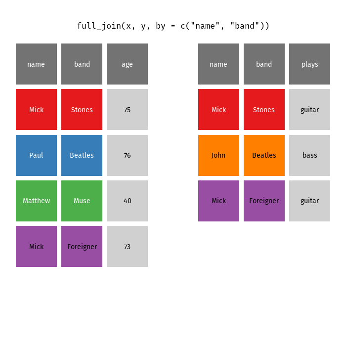
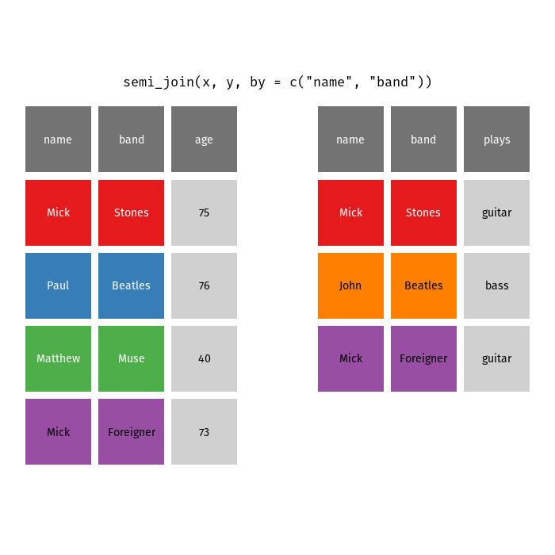
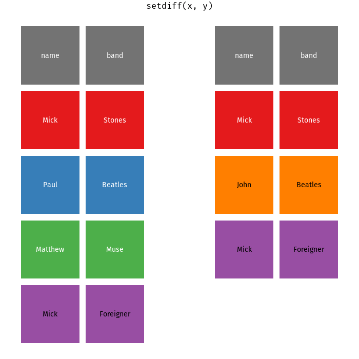
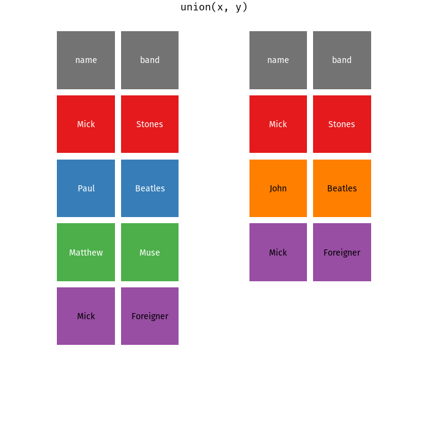
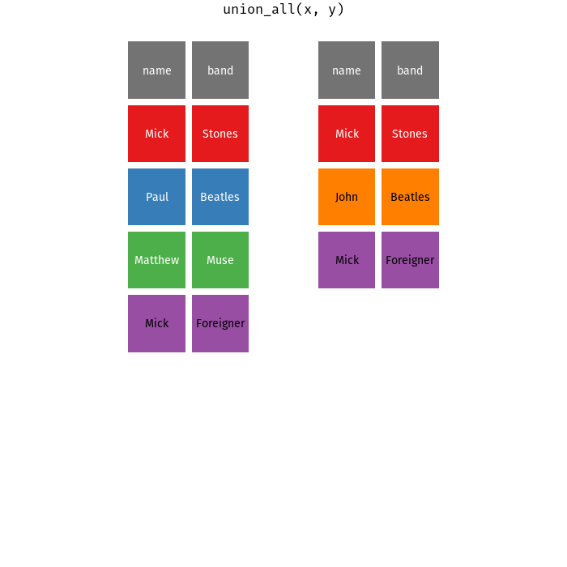

<!--self_contained: true
https://github.com/yihui/xaringan/issues/64
https://github.com/yihui/xaringan/issues/10
https://github.com/gnab/remark/issues/194
-->


<!--https://stackoverflow.com/questions/48976338/how-can-i-modifiy-the-positions-of-the-text-and-logo-on-rmarkdown-title-slide/49018455#49018455!-->

```{r setup, include=FALSE}
options(htmltools.dir.version = FALSE)
knitr::opts_chunk$set(fig.dim = c(4.8, 4.5),
                      fig.retina = 2, 
                      out.width = "100%",
                      cache = TRUE)
knitr::opts_hooks$set(fig.callout = function(options) {
  if (options$fig.callout) {
    options$echo <- FALSE
    options$out.height <- "99%"
    options$fig.width <- 16
    options$fig.height <- 8
  }
  options
})
# define colors
# devtools::install_github("DavZim/colorTable")
library(colorTable)
blue_bg <- "#74add1"
blue2_bg <- "#deebf7" # light blue
green_bg <- "#a6d96a"
green2_bg <- "#4daf4a" # strong green
red_bg <- "#fc9272"
purple_bg <- "#9e9ac8"
purple2_bg <- "#984ea3" # strong purple
orange_bg <- "#ff7f00"
yellow_bg <- "#ffff33"
red2_bg <- "#e41a1c" # strong red
```

# Outline

1. Using `dplyr` to manipulate data


---
class: inverse, center, middle

# Data Manipulation with dplyr

<html><div style='float:left'></div><hr color='#EB811B' size=1px width=720px></html> 

---
class: inverse, center, middle


---

# dplyr Overview

`dplyr` is a package for consistent data manipulation of (tidy) data

- `filter()`: filter observations/rows
- `arrange()`: arrange (sort) by a variable/column
- `select()`: select a variable/column
- `mutate()`: change or create values of a variable
- `summarise()`: summarise the dataset into a single observation
- complemented by `group_by()`

Further information: http://dplyr.tidyverse.org/

Load `dplyr` with the tidyverse
```{r, message=F}
library(tidyverse)
```

---

# Recap Tidy Data


<small><small>Source: http://r4ds.had.co.nz/tidy-data.html</small></small>

---

# The Dataset: 336k Flights from NYC in '13

.smaller[
```{r}
# install.packages("nycflights13")
library(nycflights13)
flights %>% glimpse()
```
]

---

# Filter Observations

```{r, echo=FALSE}
df <- data_frame(var = c("x", "y", "x", "x", "y"),
                 x = ".",
                 z = ".")
df2 <- df %>% filter(var == "x")
names(df) <- names(df2) <- c("var", ".", ".")
```

`filter()` the observations (rows) of a dataset for certain values.

<html><div style='float:left'></div><hr color='#EB811B' size=1px width=100%></html> 

--

.left-three[
<h3><center>Input</center></h3>
<br>
```{r, echo=FALSE, results="asis"}
color_table(df, header_bg = blue_bg, row_bgs = ifelse(df$var == "x", red_bg, green_bg))
```
]
.left-three[
<h3>Command</h3>
<br>
```{r, eval=FALSE}
df %>%
  filter(var == "x")
```
]
--
.right-three[
<h3><center>Output</center></h3>
<br>
```{r, echo=FALSE, results="asis"}
color_table(df2, header_bg = blue_bg, body_bg = red_bg)
```
]

---

# Filter Example

<mark>Query</mark>: Find the long-distance flights (> 2500 miles) that departed in spring 2013.

<html><div style='float:left'></div><hr color='#EB811B' size=1px width=100%></html> 

--
.semi-small[
```{r}
flights %>% 
  filter(month <= 03 & distance > 2500)
```
]

---

# Arrange Observations
```{r, echo=FALSE}
df1 <- data_frame(var1 = c(2, 3, 1, 1, 2, 1),
                  var2 = c(4, 1, 2, 1, 4, 3),
                  x = ".")
df2 <- df1 %>% arrange(var1, -var2)
names(df1) <- names(df2) <- c("var1", "var2", ".")
col1 <- col2 <- matrix(green_bg, nrow = nrow(df1), ncol = ncol(df1))
col1[, 1] <- color_gradient(df1$var1, c("#e0ecf4", "#8c6bb1"))
col1[, 2] <- color_gradient(df1$var2, c("#fee8c8", "#ef6548"))
col2[, 1] <- color_gradient(df2$var1, c("#e0ecf4", "#8c6bb1"))
col2[, 2] <- color_gradient(df2$var2, c("#fee8c8", "#ef6548"))
```

`arrange()` the observations (rows) of a dataset for certain values.

<html><div style='float:left'></div><hr color='#EB811B' size=1px width=100%></html> 

--

.left-three[
<h3><center>Input</center></h3>
<br>
```{r, echo=FALSE, results="asis"}
color_table(df1, header_bg = blue_bg, body_bg = col1)
```
]
.left-three[
<h3>Command</h3>
<br>
```{r, eval=FALSE}
df %>%
  arrange(var1, desc(var2))
```
]
--
.right-three[
<h3><center>Output</center></h3>
<br>
```{r, echo=FALSE, results="asis"}
color_table(df2, header_bg = blue_bg, body_bg = col2)
```
]

---

# Arrange Example

<mark>Query</mark>: Sort the flights by day of the month (ascending) and departure-delay (descending).

<html><div style='float:left'></div><hr color='#EB811B' size=1px width=100%></html> 

--
.semi-small[
```{r}
flights %>% 
  arrange(day, desc(dep_delay))
```
]

---

# Select Variables
```{r, echo=FALSE}
df1 <- data_frame(var1 = rep(".", 6),
                  var2 = ".",
                  var3 = ".")
df2 <- df1 %>% select(var1, foo = var3)
col1 <- col2 <- matrix(green_bg, nrow = nrow(df1), ncol = ncol(df1))
head_col <- c(red_bg, blue_bg, red_bg)
```

`select()` certain variables/columns of a dataset and/or rename the variable<sup>1</sup>.

.footnote[
.smaller[
[1] If you don't want to drop unused variables, use `rename()`.
] 
]


<html><div style='float:left'></div><hr color='#EB811B' size=1px width=100%></html> 

--

.left-three[
<h3><center>Input</center></h3>
<br>
```{r, echo=FALSE, results="asis"}
color_table(df1, col_bgs = c(red_bg, blue_bg, red_bg))
```
]
.left-three[
<h3>Command</h3>
<br>
```{r, eval=FALSE}
df %>%
  select(var1, foo = var3)
```
]
--
.right-three[
<h3><center>Output</center></h3>
<br>
```{r, echo=FALSE, results="asis"}
color_table(df2, col_bgs = red_bg)
```
]

---

# Select Example

<mark>Query</mark>: Select the carrier and the tail-number of the flights.

<html><div style='float:left'></div><hr color='#EB811B' size=1px width=100%></html> 

--
.semi-small[
```{r}
flights %>% 
  select(carrier, tail_number = tailnum)
```
]

---

# Mutate Variables
```{r, echo=FALSE}
df1 <- data_frame(var =  c(2, 3, 1, 1, 2, 1),
                  x = ".",
                  y = ".")
df2 <- df1 %>% mutate(var = var * 2,
                      foo = 1:n())
names(df1) <- c("var", ".", ".")
names(df2) <- c("var", ".", ".", "foo")
col1 <- matrix(green_bg, nrow = nrow(df1), ncol = ncol(df1))
col2 <- matrix(green_bg, nrow = nrow(df2), ncol = ncol(df2))
col1[, 1] <- color_gradient(df1$var, c("#fee8c8", "#ef6548"))
col2[, 1] <- color_gradient(df2$var, c("#fee8c8", "#7f0000"))
col2[, 4] <- color_gradient(df2$foo, c("#e0ecf4", "#8c6bb1"))
head_col1 <- c(red_bg, blue_bg, blue_bg)
head_col2 <- c(red_bg, blue_bg, blue_bg, purple_bg)
```

`mutate()` (change or create new) variables using window functions<sup>1</sup><sup>2</sup>.

.footnote[
.smaller[
[1] A window function means that the number of observations remains unchanged, the opposite happens in summarise functions, where the number of observations is reduced.

[2] If you want to drop unused variables, use `transmute()`.
] 
]

<html><div style='float:left'></div><hr color='#EB811B' size=1px width=100%></html> 

--

.left-three[
<h3><center>Input</center></h3>
<br>
```{r, echo=FALSE, results="asis"}
color_table(df1, body_bg = col1, header_bg = head_col1)
```
]
.left-three[
<h3>Command</h3>
<br>
```{r, eval=FALSE}
df %>%
  mutate(var = var * 2,
         foo = 1:n())
```
]
--
.right-three[
<h3><center>Output</center></h3>
<br>
```{r, echo=FALSE, results="asis"}
color_table(df2, body_bg = col2, header_bg = head_col2)
```
]

---

# Mutate Example

<mark>Query</mark>: Create a unique ID for each flight and compute the flight-distance in km (distance is reported in miles).

<html><div style='float:left'></div><hr color='#EB811B' size=1px width=100%></html> 

--
.semi-small[
```{r}
flights %>% 
  mutate(id = 1:n(), 
         dist_km = distance * 1.60934) %>% 
  select(id, distance, dist_km)
```
]

---

# Summarise Variables
```{r, echo=FALSE}
df1 <- data_frame(var1 =  c(2, 3, 3, 1, 1, 2),
                  var2 = 1:6,
                  y = ".")
df2 <- df1 %>% summarise(mu1 = mean(var1),
                         min2 = min(var2),
                         max2 = max(var2))
names(df1) <- c("var1", "var2", ".")
col1 <- matrix(green_bg, nrow = nrow(df1), ncol = ncol(df1))
col2 <- matrix(green_bg, nrow = nrow(df2), ncol = ncol(df2))
col1[, 1] <- color_gradient(df1$var1, c("#fee8c8", "#ef6548"))
col1[, 2] <- color_gradient(df1$var2, c("#e0ecf4", "#8c6bb1"))
c1 <- col1[1, 1]
c2 <- col1[1, 2]
c3 <- col1[nrow(df1), 2]
head_col1 <- c(red_bg, purple_bg, blue_bg)
head_col2 <- c(red_bg, purple_bg, purple_bg)
```

`summarise()` a dataset (compute a given summary of variables)<sup>1</sup>.

.footnote[
.smaller[
[1] If the summarise function is applied to multipe variables, you can also use `summarise_if()`, `summarise_at()`, ...
] 
]

<html><div style='float:left'></div><hr color='#EB811B' size=1px width=100%></html> 

--

.left-three[
<h3><center>Input</center></h3>
<br>
```{r, echo=FALSE, results="asis"}
color_table(df1, body_bg = col1, header_bg = head_col1)
```
]
.left-three[
<h3>Command</h3>
<br>
```{r, eval=FALSE}
df %>%
  summarise(
    mu1  = mean(var1),
    min2 = min(var2),
    max2 = max(var2)
  )
```
]
--
.right-three[
<h3><center>Output</center></h3>
<br>
```{r, echo=FALSE, results="asis"}
color_table(df2, body_bg = matrix(c(c1, c2, c3), nrow = 1), header_bg = head_col2)
```
]

---

# Summarise Example

<mark>Query</mark>: Find the minimum, average, and maximum arrival-delay for all flights.

<html><div style='float:left'></div><hr color='#EB811B' size=1px width=100%></html> 

--
.semi-small[
.left-col[
```{r}
flights %>% 
  summarise(
    min_delay = min(arr_delay),
    avg_delay = mean(arr_delay),
    max_delay = max(arr_delay)
  )
```
]
]

--

.semi-small[
.right-col[
```{r,eval=F}
flights %>% 
  filter(!is.na(arr_delay)) %>% #<<
  summarise(
    min_delay = min(arr_delay),
    avg_delay = mean(arr_delay),
    max_delay = max(arr_delay)
  )
```
```{r,echo=F}
flights %>% 
  filter(!is.na(arr_delay)) %>% 
  summarise(
    min_delay = min(arr_delay),
    avg_delay = mean(arr_delay),
    max_delay = max(arr_delay)
  )
```
]
]

---

# Grouped Mutate Variables
```{r, echo=FALSE}
df1 <- data_frame(grp = c("A", "B", "A", "A", "B", "B"),
                  v = c(2, 4, 1, 3, 2, 3),
                  y = ".")
df2 <- df1 %>% 
  group_by(grp) %>% 
  mutate(v = mean(v),
         foo = 1:n())
names(df1) <- c("grp", "v", ".")
names(df2) <- c("grp", "v", ".", "foo")
col1 <- matrix(green_bg, nrow = nrow(df1), ncol = ncol(df1))
col2 <- matrix(green_bg, nrow = nrow(df2), ncol = ncol(df2))
col1[, 1] <- ifelse(df1$grp == "A", "#e41a1c", "#377eb8")
col1[, 2] <- color_gradient(df1$v, c("#fee8c8", "#ef6548"))
col2[, 1] <- ifelse(df2$grp == "A", "#e41a1c", "#377eb8")
col2[, 2] <- color_gradient(df2$v, c("#fee8c8", "#ef6548"), x_range = df1$v)
col2[, 4] <- color_gradient(df2$foo, c("#e0ecf4", "#8c6bb1"))
head_col1 <- c(green2_bg, red_bg, blue_bg)
head_col2 <- c(green2_bg, red_bg, blue_bg, purple_bg)
```

`group_by() %>% mutate()` (change or create new) variables using window functions **per group**<sup>1</sup>.

.footnote[
.smaller[
[1] The output is still grouped, to ungroup use `df %>% ... %>% ungroup()`.
] 
]

<html><div style='float:left'></div><hr color='#EB811B' size=1px width=100%></html> 

--

.left-three[
<h3><center>Input</center></h3>
<br>
```{r, echo=FALSE, results="asis"}
color_table(df1, body_bg = col1, header_bg = head_col1)
```
]
.left-three[
<h3>Command</h3>
<br>
```{r, eval=FALSE}
df %>%
  group_by(grp) %>% 
  mutate(
    v = mean(v),
    foo = 1:n()
  )
```
]
--
.right-three[
<h3><center>Output</center></h3>
<br>
```{r, echo=FALSE, results="asis"}
color_table(df2, body_bg = col2, header_bg = head_col2)
```
]

---

# Grouped Mutate Example

<mark>Query</mark>: For each flight, find the difference of the arrival-delay to the average arrival-delay of the respective airline (`carrier`).

<html><div style='float:left'></div><hr color='#EB811B' size=1px width=100%></html> 

--
.semi-small[
```{r}
flights %>% 
  filter(!is.na(arr_delay)) %>% 
  group_by(carrier) %>% 
  mutate(delta_arr_delay = arr_delay - mean(arr_delay)) %>% 
  select(carrier, delta_arr_delay)
```
]

---

# Grouped Summarise Variables
```{r, echo=FALSE}
df1 <- data_frame(grp = c("A", "B", "A", "A", "B", "B"),
                  var1 = c(2, 4, 1, 3, 2, 3),
                  var2 = 1:6,
                  y = ".")
df2 <- df1 %>% 
  group_by(grp) %>% 
  summarise(
    mu1 = mean(var1),
    max2 = max(var2)
    )
names(df1) <- c("grp", "var1", "var2", ".")
col1 <- matrix(green_bg, nrow = nrow(df1), ncol = ncol(df1))
col2 <- matrix(green_bg, nrow = nrow(df2), ncol = ncol(df2))
col1[, 1] <- ifelse(df1$grp == "A", "#e41a1c", "#377eb8")
col1[, 2] <- color_gradient(df1$var1, c("#fee8c8", "#ef6548"))
col1[, 3] <- color_gradient(df1$var2, c("#e0ecf4", "#8c6bb1"))

col2[, 1] <- ifelse(df2$grp == "A", "#e41a1c", "#377eb8")
col2[, 2] <- color_gradient(df2$mu1, c("#fee8c8", "#ef6548"), x_range = df1$var1)
col2[, 3] <- color_gradient(df2$max2, c("#e0ecf4", "#8c6bb1"), x_range = df1$var2)
head_col1 <- c(green2_bg, red_bg, purple_bg, blue_bg)
head_col2 <- c(green2_bg, red_bg, purple_bg)
```


`group_by() %>% summarise()` summarise variables **per group**<sup>1</sup>.

.footnote[
.smaller[
[1] The output is still grouped, to ungroup use `df %>% ... %>% ungroup()`.
] 
]

<html><div style='float:left'></div><hr color='#EB811B' size=1px width=100%></html> 

--

.left-three[
<h3><center>Input</center></h3>
<br>
```{r, echo=FALSE, results="asis"}
color_table(df1, body_bg = col1, header_bg = head_col1)
```
]
.left-three[
<h3>Command</h3>
<br>
```{r, eval=FALSE}
df %>% 
  group_by(grp) %>% 
  summarise(
    mu1 = mean(var1),
    max2 = max(var2)
  )
```
]
--
.right-three[
<h3><center>Output</center></h3>
<br>
```{r, echo=FALSE, results="asis"}
color_table(df2, body_bg = col2, header_bg = head_col2)
```
]

---

# Grouped Summarise Example

<mark>Query</mark>: For each airline (carrier), find the mean and meadian arrival over all flights of 2013.

<html><div style='float:left'></div><hr color='#EB811B' size=1px width=100%></html> 

--

.semi-small[
.left-col[
```{r grouped_summarise, eval=F}
flights %>% 
  filter(!is.na(arr_delay)) %>% 
  group_by(carrier) %>% 
  summarise(
    mean_delay = mean(arr_delay),
    median_delay = median(arr_delay)
  )
```
]
.right-col[
```{r grouped_summarise_output, ref.label="grouped_summarise", echo=FALSE}
```
]
]

---

# Full Query Example

<mark>Query</mark>: Find the 5 aircrafts (by tail number) that regained the most lost time (on average) and have at least 20 flights<sup>1</sup>.

.footnote[
.smaller[
[1] Time regained can be calculated as the `regain = dep_delay - arr_delay`.
] 
]

<html><div style='float:left'></div><hr color='#EB811B' size=1px width=100%></html> 

--

Part 1: Calculate the `regain`.
.semi-small[
.left-col[
```{r full_query, eval=F}
flights %>% 
  filter(
    !is.na(arr_delay),
    !is.na(dep_delay)
  ) %>% 
  mutate(
    regain = dep_delay - arr_delay
  ) %>% 
  select(tailnum, regain)
```
]
.right-col[
```{r full_query_output, ref.label="full_query", echo=FALSE}
```
]
]

---

# Full Query Example

<mark>Query</mark>: Find the 5 aircrafts (by tail number) that regained the most lost time (on average) and have at least 20 flights<sup>1</sup>.

.footnote[
.smaller[
[1] Time regained can be calculated as the `regain = dep_delay - arr_delay`.
] 
]

<html><div style='float:left'></div><hr color='#EB811B' size=1px width=100%></html> 

Part 2: Calculate the average `regain` per `tailnum`.
.semi-small[
.left-col[
```{r full_query2, eval=F}
flights %>% 
  filter(
    !is.na(arr_delay),
    !is.na(dep_delay)
  ) %>% 
  mutate(
    regain = dep_delay - arr_delay
  ) %>% 
  group_by(tailnum) %>% 
  summarise(
    n_flights = n(),
    regain = mean(regain)
  )
```
]
.right-col[
```{r full_query2_output, ref.label="full_query2", echo=FALSE}
```
]
]

---

# Full Query Example

<mark>Query</mark>: Find the 5 aircrafts (by tail number) that regained the most lost time (on average) and have at least 20 flights<sup>1</sup>.

.footnote[
.smaller[
[1] Time regained can be calculated as the `regain = dep_delay - arr_delay`.
] 
]

<html><div style='float:left'></div><hr color='#EB811B' size=1px width=100%></html> 

Part 3: Filter for the number of flights and take only the top five .
.smaller[
.left-col[
```{r full_query3, eval=F}
flights %>% 
  filter(
    !is.na(arr_delay),
    !is.na(dep_delay)
  ) %>% 
  mutate(
    regain = dep_delay - arr_delay
  ) %>% 
  group_by(tailnum) %>% 
  summarise(
    n_flights = n(),
    regain = mean(regain)
  ) %>%
  filter(n_flights > 20) %>% 
  arrange(desc(regain)) %>% 
  slice(1:5)
```
]
.right-col[
```{r full_query3_output, ref.label="full_query3", echo=FALSE}
```
]
]

---

# dplyr Summary

We use `dplyr`/`tidyverse` to manipulate data with the following functions:

- `filter()`: filter observations/rows
- `arrange()`: arrange (sort) by a variable/column
- `select()`: select a variable/column
- `mutate()`: change or create values of a variable
- `group_by() %>% mutate()`: change or create values of a variable per group
- `summarise()`: summarise the dataset into a single observation
- `group_by() %>% summarise()`: summarise the dataset per group

More information: https://cran.r-project.org/web/packages/dplyr/vignettes/dplyr.html

---

# Additional dplyr functions

Useful helpers
- `transmute()` like `mutate()` but drops unused variables
- `rename()` like `select()`* but keeps unused variables
- Helper functions for `select()`: `contains()`, `starts_with()`, `ends_with()`, `one_of()`, ... E.g., `df %>% select(starts_with("arr"))`
- `mutate_at()` and `summarise_at()` mutates/summarises multiple variables
- `mutate_if()` and `summarise_if()` mutates/summarises if a variable fulfills certain conditions

CheatSheet: https://www.rstudio.com/wp-content/uploads/2015/02/data-wrangling-cheatsheet.pdf

---
class: inverse, center, middle


---

# Bind Rows

```{r, echo=FALSE}
df1 <- data_frame(x = 1:3, y = 1:3, z = 1:3)
df2 <- data_frame(x = 1:3, y = 1:3, z = 1:3)
df_out <- bind_rows(df1, df2)

names(df1) <- names(df2) <- names(df_out) <- rep(".", ncol(df1))

head_col <- c(red_bg, purple_bg, green2_bg)

col1 <- matrix(green_bg, nrow = nrow(df1), ncol = ncol(df1))
col2 <- matrix(blue2_bg, nrow = nrow(df2), ncol = ncol(df2))
col_out <- rbind(col1, col2)
```

`bind_rows()` bind together two or more datasets by row.

<html><div style='float:left'></div><hr color='#EB811B' size=1px width=100%></html> 

--

.left-three[
<h3><center>Input</center></h3>
<br>
```{r, echo=FALSE, results="asis"}
color_table(df1, body_bg = col1, header_bg = head_col, hide_body = T)
color_table(df2, body_bg = col2, header_bg = head_col, hide_body = T)
```
]
.left-three[
<h3>Command</h3>
<br>
```{r, eval=FALSE}
bind_rows(df1, df2)
```
]
--
.right-three[
<h3><center>Output</center></h3>
<br>
```{r, echo=FALSE, results="asis"}
color_table(df_out, body_bg = col_out, header_bg = head_col, hide_body = T)
```
]

---

# Bind Rows Example

<mark>Task</mark>: Add two datasets together by rows.

<html><div style='float:left'></div><hr color='#EB811B' size=1px width=100%></html> 

--
.semi-small[
```{r}
df1 <- data_frame(id = 1:2,
                  name = c("Alice", "Bob"))
df2 <- data_frame(id = 3:4, 
                  name = c("Charlie", "Dave"))
bind_rows(df1, df2)
```
]

---

# Bind Cols

```{r, echo=FALSE}
df1 <- data_frame(w = 1:6, x = 1:6)
df2 <- data_frame(y = 1:6, z = 1:6)
df_out <- bind_cols(df1, df2)

names(df1) <- names(df2) <- rep(".", ncol(df1))
names(df_out) <- rep(".", ncol(df_out))

head_col1 <- c(red_bg, purple_bg)
head_col2 <- c(green2_bg, blue_bg)

col1 <- matrix(green_bg, nrow = nrow(df1), ncol = ncol(df1))
col2 <- matrix(blue2_bg, nrow = nrow(df2), ncol = ncol(df2))
col_out <- cbind(col1, col2)
```

`bind_cols()` bind together two or more datasets by columns.

<html><div style='float:left'></div><hr color='#EB811B' size=1px width=100%></html> 

--

.left-three[
<h3><center>Input</center></h3>
<br>
.left-col[
```{r, echo=FALSE, results="asis"}
color_table(df1, body_bg = col1, header_bg = head_col1, hide_body = T)
```
]
.right-col[
```{r, echo=FALSE, results="asis"}
color_table(df2, body_bg = col2, header_bg = head_col2, hide_body = T)
```
]
]
.left-three[
<h3>Command</h3>
<br>
```{r, eval=FALSE}
bind_cols(df1, df2)
```
]
--
.right-three[
<h3><center>Output</center></h3>
<br>
```{r, echo=FALSE, results="asis"}
color_table(df_out, body_bg = col_out, header_bg = c(head_col1, head_col2), hide_body = T)
```
]

---

# Bind Cols Example

<mark>Task</mark>: Add two datasets together by columns.

<html><div style='float:left'></div><hr color='#EB811B' size=1px width=100%></html> 

--
.semi-small[
```{r}
df1 <- data_frame(id = 1:2,
                  name = c("Alice", "Bob"))
df2 <- data_frame(sales = c(100, 95),
                  region = c("North", "South"))
bind_cols(df1, df2)
```
]

---

# Joins

```{r, echo=F, warning=F, message=F}
superheroes <- data_frame(
  superhero = c("Batman", "Joker", "Prof X", "Hellboy"),
  alignment = c("good", "bad", "good", "good"),
  publisher = c("DC", "DC", "Marvel", "Dark Horse")
)
publishers <- data_frame(
  publisher = c("DC", "Marvel", "Image Comics"),
  address = c("Burbank (CA)", "NYC (NY)", "Berkeley (CA)")
)

joined <- bind_rows(inner_join(superheroes, publishers)) %>% 
  bind_rows(data_frame(
    superhero = "???", alignment = "???", publisher = "???", address = "???"
  ))
col_heroes <- c(green2_bg, green2_bg, purple2_bg, orange_bg)
col_publ <- c(green2_bg, purple2_bg, yellow_bg)
col_joined <- c(green2_bg, green2_bg, purple2_bg, red2_bg)
```

Join the superheroes and the address of the publishers together.

<html><div style='float:left'></div><hr color='#EB811B' size=1px width=100%></html> 

.left-col[
<center><strong>Superheroes</strong></center>
.smaller[
```{r, echo=FALSE, results="asis"}
color_table(superheroes, row_bgs = col_heroes, header_bg = blue_bg, cell_width = NULL)
```
]
<br>
<center><strong>Publishers</strong></center>

.smaller[
```{r, echo=FALSE, results="asis"}
color_table(publishers, row_bgs = col_publ, header_bg = blue_bg, cell_width = NULL)
```
]
]

--

.right-col[
<center><strong>Joined Dataset</strong></center>
.smaller[
```{r, echo=FALSE, results="asis"}
color_table(joined, row_bgs = col_joined, header_bg = blue_bg, cell_width = NULL)
```
]
]


---

# Left Join

```{r, echo=FALSE}
df1 <- data_frame(id = rep(LETTERS[1:2], each = 2),
                  x = 1:4)
df2 <- data_frame(id = c("A", "C"),
                  y = 7:8)

df_out <- left_join(df1, df2, by = "id")

head_col1 <- c(red_bg, purple_bg)
head_col2 <- c(red_bg, blue2_bg)
head_col_out <- c(red_bg, purple_bg, blue2_bg)

col1 <- matrix(green_bg, nrow = nrow(df1), ncol = ncol(df1))
col2 <- matrix(green_bg, nrow = nrow(df2), ncol = ncol(df2))
col_out <- matrix(green_bg, nrow = nrow(df_out), ncol = ncol(df_out))
col1[, 1] <- rep(c(green2_bg, purple2_bg), each = 2)
col2[, 1] <- c(green2_bg, yellow_bg)
col_out[, 1] <- col1[, 1]
col_out[!df_out$id %in% df2$id, 3] <- "#252525"
```

`left_join()` to join two datasets together by a variable, taking all values from the "left" dataset (the one supplied first).

<html><div style='float:left'></div><hr color='#EB811B' size=1px width=100%></html> 

--

.left-three[
<h3><center>Input</center></h3>
<br>
.left-col[
<center>"left" df</center>
```{r, echo=FALSE, results="asis"}
color_table(df1, body_bg = col1, header_bg = head_col1, hide_body = T)
```
]
.right-col[
<center>"right" df</center>
```{r, echo=FALSE, results="asis"}
color_table(df2, body_bg = col2, header_bg = head_col2, hide_body = T)
```
]
]
.left-three[
<h3>Command</h3>
<br>
```{r, eval=FALSE}
left_join(df1, df2,
          by = "id")
```
]
--
.right-three[
<h3><center>Output</center></h3>
<br>
```{r, echo=FALSE, results="asis"}
color_table(df_out, body_bg = col_out, header_bg = head_col_out, hide_body = T)
```
]

---

# Left Join Example

<mark>Join</mark> the address of the publishers to the superheroes (preserving all data in `superheroes`).
.smaller[
```{r}
superheroes <- data_frame(
  superhero = c("Batman", "Joker", "Prof X", "Hellboy"),
  alignment = c("good", "bad", "good", "good"),
  publisher = c("DC", "DC", "Marvel", "Dark Horse")
)
publishers <- data_frame(
  publisher = c("DC", "Marvel", "Image Comics"),
  address   = c("Burbank (CA)", "NYC (NY)", "Portland (OR)")
)
```
]

<html><div style='float:left'></div><hr color='#EB811B' size=1px width=100%></html> 

--
.semi-small[
```{r}
left_join(superheroes, publishers, by = "publisher")
```
]

---

# All Joins and Set Operations

.semi-small[
.left-col[
[R4DS Mutating Joins](http://r4ds.had.co.nz/relational-data.html#mutating-joins)

> A mutating join [...] first matches observations by their keys, then copies across variables from one table to the other.

- `left_join()`
- `right_join()`
- `inner_join()`
- `full_join()`

[R4DS Filtering Joins](http://r4ds.had.co.nz/relational-data.html#filtering-joins)

> Filtering joins match observations in the same way as mutating joins, but affect the observations, not the variables.

- `semi_join()`
- `anti_join()`
]
.right-col[

[R4DS Set Operations](http://r4ds.had.co.nz/relational-data.html#set-operations)

> All these operations work with a complete row, comparing the values of every variable.

- `intersect()`
- `union()`
- `setdiff()`

See also: https://github.com/gadenbuie/tidy-animated-verbs
]
]

---

# Mutating Joins Animated

Join two datasets together, taking all variables (columns) and selected observations (rows) based on the join function.

.left-col[
`left_join()`

]
.right-col[
`right_join()`

]

https://github.com/gadenbuie/tidy-animated-verbs for animated version

---

# Mutating Joins Animated
.left-col[
`inner_join()`

]
.right-col[
`full_join()`

]

https://github.com/gadenbuie/tidy-animated-verbs for animated version

---

# Filtering Joins Animated

.left-col[
`semi_join()`

]
.right-col[
`anti_join()`

]

https://github.com/gadenbuie/tidy-animated-verbs for animated version

---

# Set Operations Animated

.left-col[
`intersect()`

]
.right-col[
`setdiff()`

]

https://github.com/gadenbuie/tidy-animated-verbs for animated version

---

# Set Operations Animated

.left-col[
`union()`

]
.right-col[
`union_all()`

]

https://github.com/gadenbuie/tidy-animated-verbs for animated version

---

# More Data

.left-col[

```{r}
help(package = "nycflights13") 
```
]

--

.right-col[
`nycflights13` hosts 5 different datasets that relate to each other.


<small><small>Source: http://r4ds.had.co.nz/relational-data.html</small></small>
]


---


# Summary

`tidyverse` makes our life easier among others with

- `readr` for data input/output
  - `read_csv` and `write_csv`
- `tidyr` for data cleaning and tidy data
  - `gather` and `spread`
- `dplyr` for data manipulation
  - `filter`, `arrange`, `select`, `mutate`, and `summarise`, plain and `group_by`

---

# More Information

dplyr:

- http://r4ds.had.co.nz/
- https://www.rstudio.com/wp-content/uploads/2015/02/data-wrangling-cheatsheet.pdf
- https://cran.r-project.org/web/packages/dplyr/vignettes/dplyr.html

